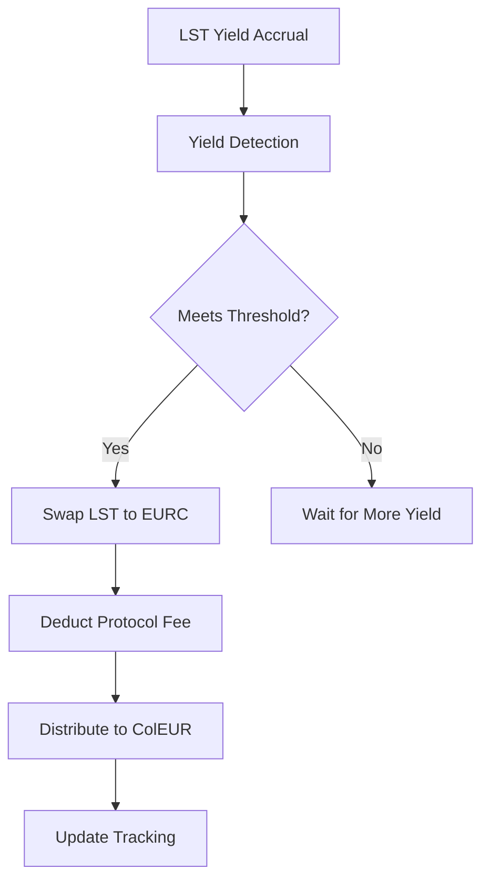

# Yield Harvesting System

## Overview

The ZEUR yield harvesting system automatically captures and converts yield generated from Liquid Staking Tokens (LSTs) in the VaultETH contract into EURC stablecoin, which is then distributed to the ColEUR vault to benefit EUR stablecoin suppliers.

## Architecture

### Core Components

1. **VaultETH**: Extended with yield harvesting capabilities
2. **YieldHarvestingManager**: Orchestrates and automates the yield harvesting process
3. **ISwapRouter**: Interface for DEX integration (Uniswap V3 compatible)
4. **ColEUR**: ERC4626 vault that receives distributed EURC yield

### Supported LST Protocols

- **Lido (stETH)**: ~2.8% APY
- **EtherFi (eETH)**: ~2.9% APY
- **RocketPool (rETH)**: ~2.6% APY
- **Morpho (mWETH)**: ~2.5% APY

## How It Works

### 1. Yield Accrual

When users deposit ETH as collateral:

```solidity
// ETH is automatically staked across LST protocols
vaultETH.lockCollateral{value: 10 ether}(user, 10 ether);
```

Over time, LST tokens accrue value through staking rewards:

- stETH: Rebasing token that increases in balance
- rETH: Exchange rate increases over time
- eETH: Value accrues through protocol mechanics
- mWETH: Morpho vault shares increase in value

### 2. Yield Calculation

The system tracks the initial staked amounts and compares with current LST values:

```solidity
function calculateTotalYield() external view returns (
    uint256 totalYield,
    LSTBalance[] memory lstBalances
) {
    // For each LST token:
    // 1. Get current balance
    // 2. Convert to ETH equivalent using exchange rate
    // 3. Compare with initial staked amount
    // 4. Calculate surplus as yield
}
```

### 3. Yield Harvesting Process



## Configuration

### VaultETH Yield Configuration

```solidity
struct YieldConfiguration {
    address swapRouter;         // DEX router address
    address eurcToken;          // EURC token address
    address colEURToken;        // ColEUR vault address
    uint24 defaultFee;          // DEX fee tier (3000 = 0.3%)
    uint256 minHarvestAmount;   // Min yield to trigger harvest
    uint256 slippageTolerance;  // Slippage protection (100 = 1%)
    bool autoCompoundEnabled;   // Auto-harvest on rebalance
}
```

### YieldHarvestingManager Configuration

```solidity
function setHarvestingConfiguration(
    uint256 harvestInterval,    // Min time between harvests
    uint256 minYieldThreshold,  // Min yield amount to harvest
    uint256 protocolFeeRate,    // Protocol fee (1000 = 10%)
    address protocolTreasury    // Fee recipient
) external;
```

## Usage Examples

### Initial Setup

```solidity
// 1. Configure yield harvesting in VaultETH
YieldConfiguration memory config = YieldConfiguration({
    swapRouter: UNISWAP_V3_ROUTER,
    eurcToken: EURC_TOKEN_ADDRESS,
    colEURToken: COL_EUR_ADDRESS,
    defaultFee: 3000, // 0.3%
    minHarvestAmount: 0.1 ether,
    slippageTolerance: 100, // 1%
    autoCompoundEnabled: true
});
vaultETH.setYieldConfiguration(config);

// 2. Configure harvesting manager
yieldManager.setHarvestingConfiguration(
    1 days,        // Harvest daily
    0.1 ether,     // Min 0.1 ETH yield
    1000,          // 10% protocol fee
    treasury       // Fee recipient
);

// 3. Add keepers for automation
yieldManager.addKeeper(KEEPER_ADDRESS);
```

### Manual Yield Harvesting

```solidity
// Check if harvest is ready
(bool canHarvest, uint256 yield, string memory reason) =
    yieldManager.canHarvest();

if (canHarvest) {
    // Execute harvest
    uint256 eurcHarvested = yieldManager.executeHarvest();
    console.log("Harvested:", eurcHarvested, "EURC");
}
```

### Automated Harvesting

Keepers can monitor and automatically execute harvests:

```solidity
// Keeper bot logic
if (yieldManager.canHarvest()) {
    yieldManager.executeHarvest();
}

// Or use the auto-compound feature
vaultETH.rebalance(); // Triggers harvest if configured
```

## Yield Distribution Flow

1. **Yield Detection**: System identifies LST yield above threshold
2. **Harvesting**: LST yield swapped to EURC via DEX
3. **Fee Deduction**: Protocol fee sent to treasury
4. **Distribution**: Remaining EURC sent to ColEUR vault
5. **User Benefit**: EUR suppliers earn additional yield

### ColEUR Integration

The harvested EURC is distributed to the ColEUR vault, which:

- Increases the vault's total assets
- Improves the exchange rate for existing shareholders
- Provides additional yield to EUR stablecoin suppliers

```solidity
// When EURC is sent to ColEUR:
// totalAssets() increases
// convertToAssets() rate improves
// EUR suppliers benefit from increased yield
```

## Security Features

### Access Control

- Only authorized addresses can configure harvesting
- Keeper role for harvest execution
- Emergency pause functionality

### Risk Management

- Slippage protection on swaps
- Minimum harvest thresholds
- Protocol fee caps (max 50%)
- Emergency withdrawal functions

### Monitoring

```solidity
// Track harvesting performance
function getHarvestingStats() external view returns (
    uint256 totalYieldHarvested,
    uint256 totalFeesCollected,
    uint256 totalDistributedToColEUR,
    uint256 lastHarvestTime,
    bool isPaused
);
```

## Benefits

### For Users

- **Passive Income**: Automatic yield generation on collateral
- **Capital Efficiency**: Earn yield while borrowing
- **Diversified Yield**: Risk spread across multiple LST protocols
- **Transparent**: All yields visible on-chain

### For EUR Suppliers

- **Additional Yield**: Benefit from ETH staking rewards
- **Stable Returns**: Consistent yield in EURC stablecoin
- **ERC4626 Standard**: Compatible with existing DeFi tools

### For Protocol

- **Revenue Generation**: Protocol fees from yield harvesting
- **Competitive Advantage**: Higher effective yields
- **User Retention**: Additional value proposition

## Integration Guide

### For Developers

1. **Monitor Yield**:

```solidity
(uint256 totalYield, LSTBalance[] memory balances) =
    vaultETH.calculateTotalYield();
```

2. **Check Harvest Status**:

```solidity
(bool ready, uint256 yield, string memory reason) =
    yieldManager.canHarvest();
```

3. **Execute Harvest**:

```solidity
uint256 eurcReceived = yieldManager.executeHarvest();
```

### For Keepers

Implement automated monitoring:

```javascript
// Pseudo-code for keeper bot
setInterval(async () => {
  const canHarvest = await yieldManager.canHarvest();
  if (canHarvest[0]) {
    await yieldManager.executeHarvest();
  }
}, 3600000); // Check hourly
```

## Economic Impact

### Yield Enhancement

- Base lending APY: ~3-5%
- Additional yield from LST harvesting: ~2-3%
- **Total effective yield: ~5-8%**

### Fee Structure

- Protocol fee: 10% of harvested yield
- Remaining 90% distributed to EUR suppliers
- Gas costs optimized through batching

## Risk Considerations

### Smart Contract Risk

- Multiple LST protocol dependencies
- DEX swap risks
- Oracle price feed risks

### Market Risk

- LST token depegging
- Slippage on large swaps
- EURC liquidity risk

### Operational Risk

- Keeper reliability
- Configuration errors
- Emergency response procedures

## Future Enhancements

1. **Multi-Asset Support**: Extend to LINK and other collaterals
2. **Advanced Routing**: Optimal swap path discovery
3. **Yield Predictions**: ML-based yield forecasting
4. **Cross-Chain**: Bridge yields from L2s
5. **Insurance**: Slashing protection integration

## Conclusion

The ZEUR yield harvesting system creates a powerful flywheel effect where:

- ETH collateral generates staking yields
- Yields are converted to EUR stablecoin
- EUR suppliers receive enhanced returns
- Protocol captures fees for sustainability

This mechanism significantly improves capital efficiency and creates additional value for all participants in the ZEUR ecosystem.
