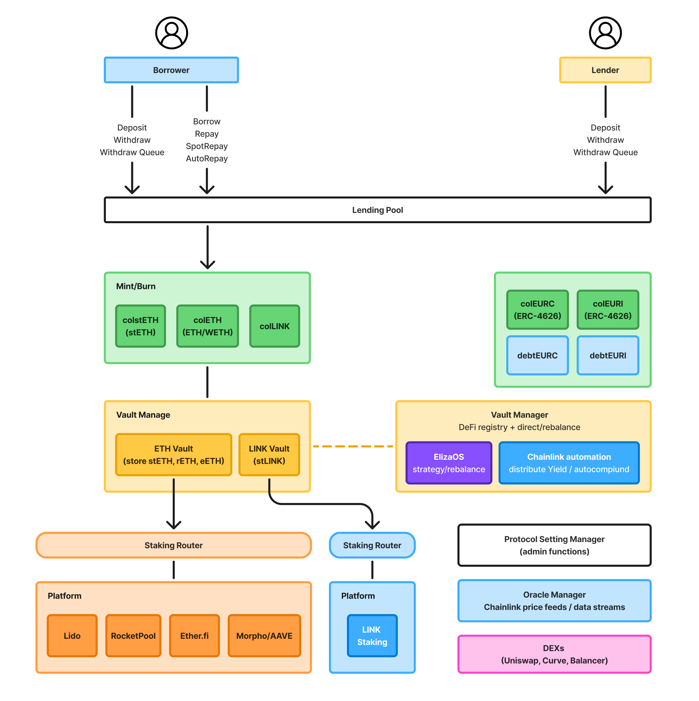

# **Mechanism**

## **Overall Flow Summary**



- **Borrower**: Deposits collateral and borrows zero-interest EUR stablecoins.
- **Lender**: Deposits EUR stablecoins to provide liquidity and earn yield.
- **VaultManager**: Manages collateral, rebalances portfolios, handles staking, and distributes yield.
- **ElizaOS + Chainlink Automation**: Executes automated strategies and rebalances based on real-time data.

## **Component Breakdown**

### **Borrower / Lender Interface**

- **Borrower** can `deposit`, `borrow`, `repay`, `spotRepay`, and `autoRepay`.
- **Lender** deposits EUR stablecoins (`colEURC`) to supply liquidity.

### **LendingPool**

- Core contract that handles lending and borrowing.
- **PoolConfigurator** provides admin-level configurations for the pool.

### **Collateral Vaults**

- Separate vaults for different collateral assets:

  - `stETHVault`: For staked ETH from Lido and similar sources.
  - `ETHVault`: For native ETH.
  - `LINKVault`: For Chainlink tokens.

- All vaults mint **colTokens** (e.g., colstETH, colETH, colLINK).
- Collateral tokens are **non-rebase ERC20** for stable asset tracking.

### **VaultManager**

- Handles **DeFi registry + direct rebalancing**.
- Interfaces with vaults to auto-distribute and auto-compound yields.
- Interacts with external protocols:

  - **Lido, RocketPool, Etherfi**: For ETH staking.
  - **Morpho / Aave**: For lending strategies.
  - **LINK staking**: For Chainlink-based yield.

### **ElizaOS**

> The strategic engine of the Zeur protocol

- Key features:
  1. **Position Management**: Defines target allocations, tracks vault balances and withdrawal queues.
  2. **Data Fetching**: Gathers APRs, gas prices, and optionally cross-chain liquidity data.
  3. **Yield / Market Analytics**: Tracks performance, risk, and applies auto-compounding.
  4. **Optimization Engine**: Simulates scenarios, calculates best allocations, and sets thresholds.
  5. **Execution / Automation**: Executes rebalance transactions based on strategy.
  6. **Monitoring / Logging**: Logs activity and status.

### **Chainlink Integration**

- **Price Feeds**: Real-time prices for assets like ETH, LINK, stETH.
- **Automation**: Automatically triggers conditions such as auto-repay or liquidation.
- **Staking**: Integrated with LINKVault for staking functionality.

### **Euro Stablecoin Structure**

- `colEURC`: ERC4626-based collateralized EUR stablecoins.
- `debEURC`: Debt tokens representing borrowed amounts.
- Total assets:

  ```
  totalAssets = balanceOf(colEURC) + debEURC.totalSupply
  ```

## **DEX Integration (Uniswap, Curve, Balancer, etc.)**

- Enables:
  - **Instant withdrawal** using DEX (check for rate/slippage).
  - **Large withdrawals** and LINK withdrawals to queue.
  - **spotRepay / autoRepay** for debt management.
  - **Simple liquidation** system.

## **Expansion Ideas (from Notes section)**

- **VaultManager for EUR stablecoins**
  → Proposed to optimize unused EUR in protocols like Morpho/Aave. Needs careful implementation to balance yield and liquidity.

## Technical Summary

| Item               | Description                                     |
| ------------------ | ----------------------------------------------- |
| Collateral Assets  | ETH, stETH, LINK, etc.                          |
| colTokens          | colETH, colstETH, etc. (non-rebase ERC20)       |
| Vault Type         | ERC4626, isolated strategy vaults               |
| Automation Engine  | ElizaOS + Chainlink Automation                  |
| Yield Optimization | Auto-staking, auto-compound, DeFi yield farming |
| Risk Management    | Spot repay, auto repay, liquidation             |
| DEX Support        | Uniswap, Curve, Balancer                        |
| Regulation Goal    | MiCA-compliant, EUR-focused for EU market       |
